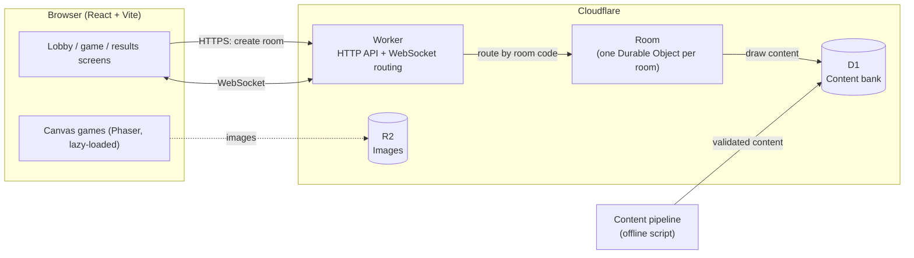
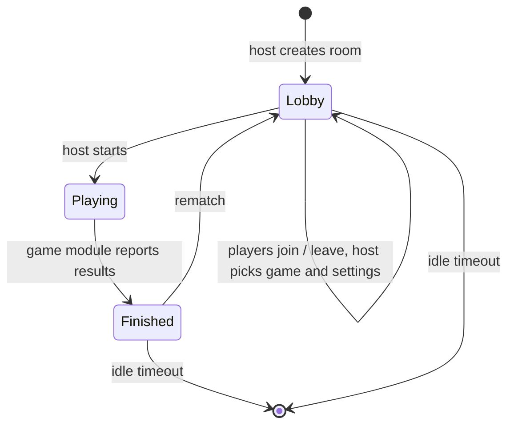

# Whizard Architecture

Whizard is a free, real-time platform for playing games with friends: a couple on a long-distance call, or a room full of people on game night. Players join a room with a nickname and a room code, everyone gets the same challenge at the same time, and results appear live.

Quiz is the launch game. The platform is built so that more games (Word Rush, Memory, Reaction, social and party games) plug into the same room system. The full list is in [GAMES.md](GAMES.md).

This document covers the system design, the key decisions behind it, and the order we build it in.

## Goals

- **Instant to play.** No accounts. Open the link, pick a nickname, enter a code, play.
- **Fair.** Everyone gets the same content in the same order. The server owns rules, scoring and timing, so a slow connection doesn't cost points and nobody can cheat from the browser.
- **Fast.** Moving between questions should feel instant. The first page load should be quick on a phone over 4G.
- **Cheap to run with unpredictable traffic.** Usage will come in bursts (evenings, weekends, game nights). Idle time should cost close to nothing, and a sudden spike shouldn't need manual scaling.
- **One platform, many games.** Adding a game means writing its rules and its screens. Rooms, lobbies, reconnection and timing are shared.

## Non-goals (for now)

- User accounts, profiles, friends lists
- Global leaderboards
- Native mobile apps (the web app should work well on phones)
- 3D games

## High-level design



The web app and the Worker deploy together as a single Cloudflare Worker: the Worker handles `/api/*` and serves the built web app for everything else. Client and API share one origin, so there's no CORS setup.

### Why a room is a Durable Object

A game room is small, short-lived and needs one source of truth. A Cloudflare Durable Object is exactly that: a single-threaded instance with its own storage, addressed by name. We name each one after its room code.

- **No routing layer.** Every player who connects with code `K7QX2M` reaches the same instance. There's no Redis pub/sub and no sticky sessions.
- **Authoritative and race-free.** One thread handles all messages for a room, so two answers arriving at the same moment can't corrupt state.
- **Close to the players.** The object is created near the first player to connect, at the edge.
- **Costs nothing while idle.** With the WebSocket hibernation API, a room waiting in the lobby isn't billed for wall-clock time. Traffic spikes just mean more rooms, and each room runs on its own.

## Repository layout

A TypeScript monorepo using pnpm workspaces:

```
whizard/
├── apps/
│   ├── web/            React + Vite client (dev server runs the Worker too)
│   └── server/         Cloudflare Worker, Room Durable Object, wrangler config
├── packages/
│   ├── protocol/       Message types and runtime validation (zod), shared by client and server
│   └── game-core/      Pure game logic: room codes, game modules, scoring
├── tools/
│   └── content-gen/    Offline pipeline that generates, checks and imports content (M3)
└── docs/
```

`game-core` does no I/O, so it's easy to unit-test and the server and client can't drift apart on the rules.

## How games plug in

The room and the games are separate. The **room** handles everything every game needs: connections, nicknames, the host, the lobby, reconnection, timers, saving state and sending updates. A **game module** holds only the rules of one game, as pure functions:

```ts
interface GameModule<Settings, State, Action, View> {
  id: string; // "quiz", "word-rush", "impostor", ...
  settings: ZodType<Settings>; // what the host can choose in the lobby
  actions: ZodType<Action>; // what a player can send during the game
  contentNeeded(settings: Settings): ContentRequest; // e.g. 20 easy Bible questions
  setup(settings: Settings, players: PlayerId[], content: Content, seed: number): Transition<State>;
  onAction(state: State, player: PlayerId, action: Action, now: number): Transition<State>;
  onTimer(state: State, timerId: string, now: number): Transition<State>;
  viewFor(state: State, player: PlayerId): View; // what this player may see
  results(state: State): Standings | null; // null while the game is running
}

type Transition<S> = { state: S; timers?: { id: string; at: number }[] };
```

This shape covers every game on the list:

- **Hidden information** goes through `viewFor`. A quiz player never receives the answer before answering. In Impostor, only the impostor's view says "you are the impostor".
- **Timed games** (Classic quiz rounds, Reaction, Draw & Guess) ask the room for timers. The room runs them on one Durable Object alarm and calls `onTimer`.
- **Social and party games** use the same actions: votes, typed answers and drawing strokes are all player actions.
- **Randomness** comes only from the `seed`, so a game can be replayed exactly from its seed and action log. That makes bugs reproducible and tests deterministic.

Each game's screens live in the web app under `src/games/<id>/`. Canvas-heavy games load Phaser on demand, so players of other games never download it.

## Quiz (launch game)

The host picks a **category**, a **difficulty**, the **number of questions** and a **variant**. The room draws one question set, and every player gets the same questions in the same order.

Categories at launch: Bible, Geography, History, Science, Animals, Football, Movies, Music, Nigerian culture, General knowledge, Pop culture.

| Variant         | How it plays                                                                                                                                                                   | Winner                           |
| --------------- | ------------------------------------------------------------------------------------------------------------------------------------------------------------------------------ | -------------------------------- |
| **Classic**     | Everyone sees each question at the same moment, with a timer. The round ends when everyone has answered or time runs out, then the answer and standings are shown.             | Most points                      |
| **Speed Quiz**  | Everyone works through the same set at their own pace. A player who finishes goes straight to the results, which update live as others finish ("Tolu is on question 7 of 20"). | Most points, then fastest finish |
| **Streak**      | Same questions, own pace, but the first wrong answer ends your run.                                                                                                            | Longest streak, then fastest     |
| **Elimination** | Classic rounds, but a wrong answer or no answer knocks you out. If everyone left gets it wrong, nobody is knocked out. Players who are out keep watching.                      | Last player standing             |

## Room lifecycle



- **Room codes** are 6 characters from an alphabet with no look-alike characters (no `0/O`, `1/I/L`). That gives about 890 million combinations. On creation the server checks the code is free and retries if it isn't.
- **Room state** lives in Durable Object storage, so it survives hibernation and restarts.
- **Cleanup** runs from a Durable Object alarm. A room is deleted after 30 minutes with no activity.
- **Limits:** up to 16 players per room, nicknames up to 20 characters.
- **Host handover:** if the host leaves, the longest-connected player becomes host.

## Real-time protocol

JSON messages over one WebSocket per player. Every message has a `type` and is validated with zod on both ends. Messages that fail validation are dropped.

| Client → Server                    | Purpose                                                                   |
| ---------------------------------- | ------------------------------------------------------------------------- |
| `join { nickname, sessionToken? }` | Join or rejoin a room                                                     |
| `configure { game, settings }`     | Host picks the game and its settings in the lobby                         |
| `start {}`                         | Host starts the game                                                      |
| `action { payload }`               | A game move (an answer, a vote, a stroke). Validated by the game's schema |
| `ping { t }`                       | Measure round-trip time and clock offset                                  |
| `rematch {}`                       | Host returns everyone to the lobby                                        |

| Server → Client                             | Purpose                                        |
| ------------------------------------------- | ---------------------------------------------- |
| `welcome { playerId, sessionToken, room }`  | Full snapshot on join or rejoin                |
| `lobby { players, game, settings, hostId }` | Lobby changed                                  |
| `view { view }`                             | This player's view of the game, from `viewFor` |
| `results { standings, final }`              | Live or final results                          |
| `pong { t, serverTime }`                    | Reply to `ping`                                |
| `error { code, message }`                   | Something was rejected                         |

The protocol has a version number, so an old client gets a clear "please refresh" message instead of breaking.

### Reconnection

On first join the server issues a random `sessionToken`, which the browser keeps in `sessionStorage`. If a phone locks or the network drops, the client reconnects with backoff and sends the token. The room restores that player's place: same player, same score, same question.

## Fair timing and scoring

**The server holds the answers.** Nothing a player shouldn't know yet is ever sent to their browser. The server checks every answer.

**Answer choices are shuffled per room** on the server, so the correct answer isn't always in the same position.

**Timing doesn't punish slow connections.** Measuring purely on the server would count each player's network delay as thinking time, which is unfair when one player is on the other side of the world. Instead:

1. The client measures how long the question was on screen before the tap (`clientElapsedMs`, using `performance.now()`).
2. The server measures the time between sending the question and receiving the answer.
3. The server accepts the client's time only if it fits inside that window, allowing for the player's measured round-trip time. Anything outside it is replaced with the server's own measurement.

**Simultaneous starts.** For games where everyone must see something at the same moment (Classic rounds, Reaction), the server sends the content slightly ahead with a start time in server time. Each client works out its clock offset from `ping`/`pong` and reveals the content at that moment. A player on a slow connection sees the question at the same instant as everyone else instead of a few hundred milliseconds late.

**Quiz scoring** (in `game-core`, easy to tune):

```
points = correct ? round(base × (0.5 + 0.5 × (1 − elapsed / timeLimit))) : 0
base   = 1000 (easy) · 1250 (medium) · 1500 (hard)
```

A correct answer earns between 50% and 100% of the base points, depending on speed. A wrong answer or a timeout earns 0. Ties are broken by total time taken.

## Content bank

Game content is prepared ahead of time and stored, not written while players wait. That keeps games starting instantly, keeps the cost fixed however many people play, and means everything has been checked before anyone sees it.

Each game that needs content gets its own table: quiz questions first, later word lists (Word Rush), group sets (Connections), and prompts for the social games (Most Likely To, Would You Rather, Predict Me).

### Quiz questions (D1 / SQLite)

```sql
CREATE TABLE questions (
  id              TEXT PRIMARY KEY,
  category        TEXT NOT NULL,        -- bible, geography, football, nigerian-culture, ...
  topic           TEXT,                 -- e.g. "Genesis", "Rivers", "Premier League"
  difficulty      TEXT NOT NULL,        -- easy, medium, hard
  prompt          TEXT NOT NULL,
  choices         TEXT NOT NULL,        -- JSON array, correct answer first
  explanation     TEXT,
  reference       TEXT,                 -- e.g. "Genesis 6:14"
  time_sensitive  INTEGER NOT NULL DEFAULT 0,  -- facts that can go stale (football, pop culture)
  checked_at      INTEGER NOT NULL,     -- when the facts were last verified
  content_hash    TEXT NOT NULL UNIQUE, -- normalised prompt + answer, for de-duplication
  status          TEXT NOT NULL DEFAULT 'approved',  -- approved, flagged, retired
  reports         INTEGER NOT NULL DEFAULT 0,
  rand_key        REAL NOT NULL,        -- stored random value for fast random draws
  created_at      INTEGER NOT NULL
);
CREATE INDEX idx_draw ON questions (category, difficulty, status, rand_key);
```

### Drawing a question set

- The room picks a random point and walks the `idx_draw` index from there. That's fast at any size, unlike `ORDER BY RANDOM()`.
- **Avoiding repeats:** without accounts, each browser keeps a list of recently seen question IDs. The host's list is sent when the game starts and those questions are skipped where possible.
- A **"report this question"** button increments `reports`. Questions with too many reports are flagged and hidden until reviewed.
- **Stale facts:** time-sensitive questions are re-verified on a schedule, and retired if they no longer hold ("Who won the last World Cup?").

### Generation pipeline (`tools/content-gen`)

An offline script that fills and grows the bank. It never runs during a game.

1. **Plan coverage.** Each category has a topic list (Bible: books, people, events; Geography: continents, capitals, rivers; ...). Requests are spread across topics and difficulties so the bank doesn't cluster around the same famous facts.
2. **Generate** candidate questions in batches through an LLM API, as structured JSON.
3. **Validate** each candidate against the schema: exactly one correct answer, distinct choices, length limits.
4. **De-duplicate** with a normalised content hash, plus a similarity check against existing questions on the same topic.
5. **Verify** with a separate pass that answers each question independently. If it disagrees with the stated answer, or finds the question ambiguous, the question is flagged for manual review instead of being imported. Bible questions must include a verse reference.
6. **Import** approved questions into D1.

Estimated cost is a few dollars per 10,000 questions. The same pipeline, with a different schema and checks, produces content for the other games.

To unblock the first playable version, we seed it with a small hand-checked Bible set (100–200 questions) before the pipeline is built.

## Canvas games (after launch)

Jigsaw, Spot It, Reaction and Draw & Guess use **Phaser**, loaded only when one of those games starts.

- **Identical boards:** the server sends a seed, and every player's jigsaw pieces or Spot It grid are generated from it, so everyone gets the same challenge.
- **Draw & Guess** sends the drawer's strokes in small batches through the room to the other players, who redraw them as they arrive.
- **Images** come from a curated set, or the host uploads one. Uploads are resized in the browser, stored in R2 under the room, and deleted when the room expires.

## Performance targets

| Metric                        | Target                                                   |
| ----------------------------- | -------------------------------------------------------- |
| Next question after answering | 1 network round trip (typically under 100 ms)            |
| Initial JavaScript            | under 150 KB gzipped. Phaser and game screens load later |
| Time to interactive on 4G     | under 2 s                                                |
| Room creation                 | under 300 ms                                             |

## Security and abuse

- **Rate limiting** room creation and joins per IP, using the Workers rate-limiting binding.
- **Validation** of every incoming message with a size cap. Unknown or malformed messages are dropped.
- **Nickname and text filtering** for length, characters and a basic profanity list. This matters more once social games let players type answers.
- **No personal data stored.** Nicknames, typed answers and uploaded images live only as long as the room.
- **Hidden information stays on the server** until a player is allowed to see it.

## Testing and CI

- **Unit tests** (Vitest) for `game-core`: every game module, scoring, timing clamps, content drawing. Game modules are pure, so tests replay a seed and a list of actions and check the result.
- **Integration tests** for the Room Durable Object, using Cloudflare's Vitest pool to run it in the real Workers runtime.
- **End-to-end tests** (Playwright): several browsers join the same room and play a full game.
- **GitHub Actions** on every push and pull request: format, lint, typecheck, tests and a production build.

## Key decisions

| Decision          | Chosen                                 | Alternatives considered                                           | Why                                                                                                             |
| ----------------- | -------------------------------------- | ----------------------------------------------------------------- | --------------------------------------------------------------------------------------------------------------- |
| Real-time backend | Cloudflare Workers + Durable Objects   | Node.js + `ws`/Socket.IO on a VM, with Redis for multiple servers | Rooms map directly to Durable Objects. No routing layer, no always-on server bill, handles spikes on its own    |
| Game rules        | Pure game modules behind one interface | Separate server code per game                                     | New games reuse rooms, reconnection and timing. Rules are testable and replayable without a network             |
| Frontend          | React + Vite, TypeScript               | Next.js                                                           | The app is interactive and client-side. A single-page app is simpler and faster to load                         |
| Transport         | Raw WebSocket + zod-validated JSON     | Socket.IO, Colyseus                                               | Small, explicit, typed protocol with no extra runtime dependency                                                |
| Content           | Pre-built, verified content bank       | Generating content live per game                                  | Instant starts, fixed cost, everything checked, easy to avoid repeats                                           |
| 2D games          | Phaser (lazy-loaded)                   | Plain canvas                                                      | Mature 2D engine, good fit for jigsaws, drawing and reaction games                                              |
| 3D                | Not now                                | PlayCanvas                                                        | No 3D game is planned yet. Revisit if one is designed                                                           |
| Language          | TypeScript everywhere                  | Java                                                              | One language across client, server and tools, with shared types. The Workers runtime runs JavaScript/TypeScript |

## Build plan

| Milestone                | Scope                                                                                          | Status |
| ------------------------ | ---------------------------------------------------------------------------------------------- | ------ |
| **M0: Foundations**      | Monorepo, lint/format, CI, Worker + Room Durable Object, web app, room codes, WebSocket ping   | Done   |
| **M1: Rooms**            | Nicknames, live lobby, host and host handover, game settings, reconnection, game module runner |        |
| **M2: Quiz**             | Classic and Speed Quiz variants, seeded Bible set, scoring, live results, rematch              |        |
| **M3: Content pipeline** | Generate, validate, de-duplicate, verify, import. Fill all 11 quiz categories                  |        |
| **M4: Launch**           | Streak and Elimination variants, visual design, sounds, share link, report button, no repeats  |        |
| **After launch**         | New games category by category, in the order in [GAMES.md](GAMES.md)                           |        |

The first playable version is **M0 to M2**: you and a friend can play a Bible quiz together.

## Running locally

```sh
pnpm install
pnpm dev          # web app and Worker together on http://localhost:5173
pnpm test         # unit tests
pnpm lint && pnpm typecheck
```

## Open items

- A free **Cloudflare account** is needed before the first deploy. Then `pnpm deploy` publishes the whole app.
- An **LLM API key** is needed for the content pipeline (M3).
- **Domain name:** optional. The app can run on a free `*.workers.dev` address until there is one.
