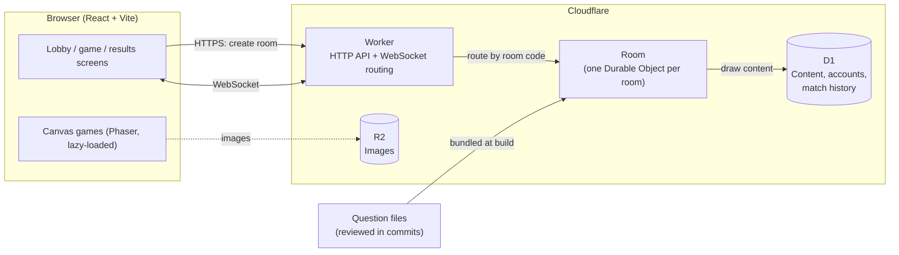
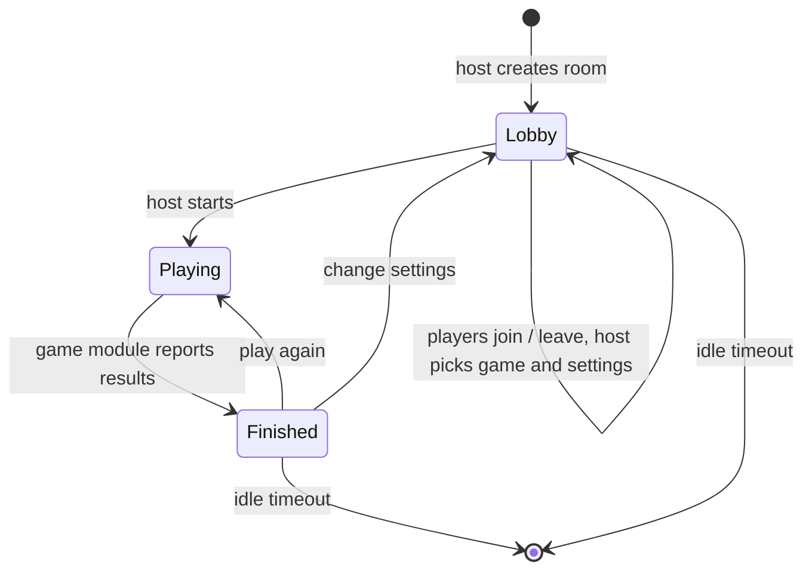

# Whizard Architecture

Whizard is a free, real-time platform for playing games with friends: a couple on a long-distance call, or a room full of people on game night. Players join a room with a nickname and a room code, everyone gets the same challenge at the same time, and results appear live.

Quiz is the launch game. The platform is built so that more games (Word Rush, Memory, Reaction, social and party games) plug into the same room system. The full list is in [GAMES.md](GAMES.md).

This document covers the system design, the key decisions behind it, and the order we build it in.

## Goals

- **Instant to play.** No sign-up needed. Open the link, pick a nickname, play. Accounts are optional and add stats, friends and pings.
- **Fair.** Everyone gets the same content in the same order. The server owns rules, scoring and timing, so a slow connection doesn't cost points and nobody can cheat from the browser.
- **Fast.** Moving between questions should feel instant. The first page load should be quick on a phone over 4G.
- **Cheap to run with unpredictable traffic.** Usage will come in bursts (evenings, weekends, game nights). Idle time should cost close to nothing, and a sudden spike shouldn't need manual scaling.
- **One platform, many games.** Adding a game means writing its rules and its screens. Rooms, lobbies, reconnection and timing are shared.

## Non-goals (for now)

- Global leaderboards (leaderboards are per friend group)
- Native mobile apps (the web app should work well on phones)
- 3D games

## High-level design



The web app and the Worker deploy together as a single Cloudflare Worker: the Worker handles `/api/*` and serves the built web app for everything else. Client and API share one origin, so there's no CORS setup.

### Why a room is a Durable Object

A game room is small, short-lived and needs one source of truth. A Cloudflare Durable Object is exactly that: a single-threaded instance with its own storage, addressed by name. We name each one after its room code.

- **No routing layer.** Every player who connects with code `K7QX2M` reaches the same instance. There's no Redis pub/sub and no sticky sessions.
- **Authoritative and race-free.** One thread handles all messages for a room, so two answers arriving at the same moment can't corrupt state.
- **Close to the players.** The object is created near the first player to connect, at the edge.
- **Costs nothing while idle.** With the WebSocket hibernation API, a room waiting in the lobby isn't billed for wall-clock time. Traffic spikes just mean more rooms, and each room runs on its own.

## Repository layout

A TypeScript monorepo using pnpm workspaces:

```
whizard/
├── apps/
│   ├── web/            React + Vite client (dev server runs the Worker too)
│   └── server/         Cloudflare Worker, Room Durable Object, accounts API, D1 migrations
├── packages/
│   ├── protocol/       Message types and runtime validation (zod), shared by client and server
│   ├── game-core/      Pure game logic: room rules, game modules, scoring
│   └── content/        Question bank (server-only: it holds the answers)
└── docs/
```

`game-core` does no I/O, so it's easy to unit-test and the server and client can't drift apart on the rules.

## How games plug in

The room and the games are separate. The **room** handles everything every game needs: connections, nicknames, the host, the lobby, reconnection, timers, saving state and sending updates. A **game module** holds only the rules of one game, as pure functions:

```ts
interface GameModule<Settings, Content, State, Action, View> {
  id: string; // "quiz", "word-rush", "impostor", ...
  minPlayers: number; // 1 means it can be played solo
  maxPlayers: number;
  settingsSchema: ZodType<Settings>; // what the host can choose in the lobby
  actionSchema: ZodType<Action>; // what a player can send during the game
  contentNeeded(settings: Settings): ContentRequest; // e.g. 20 easy Bible questions
  setup(args: { settings; players; content: Content; seed: number; now: number }): State;
  onAction(state: State, playerId: string, action: Action, now: number): State | Rejection;
  onPlayerLeft(state: State, playerId: string, now: number): State;
  tick(state: State, now: number): State; // apply whatever is due: timeouts, next rounds
  nextWakeAt(state: State): number | null; // when tick next has something to do
  isFinished(state: State): boolean;
  viewFor(state: State, playerId: string): View; // what this player may see
}
```

Time is just another input. The room calls `tick` when `nextWakeAt` is reached, using its Durable Object alarm, and before every action. So a module never manages timers, and a test can jump straight to any moment by passing a time.

This shape covers every game on the list:

- **Hidden information** goes through `viewFor`. A quiz player never receives the answer before answering. In Impostor, only the impostor's view says "you are the impostor".
- **Timed games** (quiz questions, Reaction, Draw & Guess) report their next deadline through `nextWakeAt`, and the room wakes them with `tick`.
- **Solo play** needs nothing special: a game with `minPlayers: 1` can start with just the host in the room. The home screen has a "Play solo" button that creates a room and goes straight to the game settings.
- **Social and party games** use the same actions: votes, typed answers and drawing strokes are all player actions.
- **Randomness** comes only from the `seed`, so a game can be replayed exactly from its seed and action log. That makes bugs reproducible and tests deterministic.

Each game's screens live in the web app under `src/games/<id>/`. Canvas-heavy games load Phaser on demand, so players of other games never download it.

## Quiz (launch game)

The host picks a **mode**, a **category**, a **level** (easy, medium or hard) and the **number of questions** (5, 10, 15 or 20). The room draws one question set. Quiz can be played solo.

| Mode        | Questions                                                          | Points                                                            |
| ----------- | ------------------------------------------------------------------ | ----------------------------------------------------------------- |
| **Classic** | No clock. Answer, then move on.                                    | The full points for the level for each right answer               |
| **Speed**   | A countdown on every question: 10, 20 or 30 seconds, host's choice | 50% to 100% of the points for a right answer, the faster the more |

In both modes, ties are broken by who answered faster overall. A Classic question still closes after 5 minutes without an answer, so a player who walks away can't hold up everyone's final results.

Categories at launch: Bible, Geography, History, Science, Animals, Football, Movies, Music, Nigerian culture, General knowledge, Pop culture.

**Everyone starts together, then plays at their own pace.** The first question appears for every player at the same moment, and every player gets the same questions in the same order. After that nobody waits for anybody: answering takes you straight on to your next question.

**Between questions:**

| Playing          | After each answer                                                                                   |
| ---------------- | --------------------------------------------------------------------------------------------------- |
| **With friends** | The correct answer flashes for about a second, with no explanation, then the next question appears. |
| **Solo**         | The correct answer and its explanation show for 3 seconds, with a Skip button.                      |

This pacing is decided entirely on the player's own screen: the server only needs to hear "next". That's what makes the account setting simple: a signed-in player can choose to see explanations after each answer in group games too, without changing the game rules.

**Live scores.** On tablets and computers, a panel beside the question shows everyone's points as they play. Phones leave it out to keep the question and answers large. Either way it shows **rank, name and points only**: what anyone else got right or wrong stays private.

**Results.** Whoever finishes first sees the rankings straight away. They fill in as the others finish, and players still going show as "Playing…". Once everyone is done, the top three go on a podium.

**Review.** Every player gets a private review of their own game at the end: each question, their answer, the correct answer and the explanation where the category has one.

**Late joiners.** By default, someone who arrives mid-game watches until the next one. If the host turns on **Allow late join**, they join the running game instead, starting from the first question with their own countdown. It works because every player already moves at their own pace.

Streak and Elimination variants can be added later on top of this.

## Room lifecycle



- **Room codes** are 6 characters from an alphabet with no look-alike characters (no `0/O`, `1/I/L`). That gives about 890 million combinations. Creating a room claims the code in its Durable Object. If the code is already in use, the server tries another.
- **Room state** lives in Durable Object storage, so it survives hibernation and restarts. The rules for joining, leaving, host handover and expiry are pure functions in `game-core`, and the Durable Object applies them.
- **Players who drop** stay in the room, shown as offline, for 10 minutes so they can come back.
- **Host handover:** if the host leaves, the longest-connected player becomes host right away. If the host only loses connection or taps back by mistake, they keep the role for 2 minutes first, so a locked phone doesn't hand it over. Every other page shows a "Return to your room" bar while the room is still open, so a host who went back can walk straight back in, with everyone still there.
- **Cleanup** runs from a Durable Object alarm. A room is deleted 30 minutes after the last player disconnects.
- **Room settings** belong to the host: the most players the room takes (2 to 20) and whether late joiners can enter a running game.
- **Limits:** up to 20 players per room, nicknames up to 20 characters (emoji welcome), unique within the room. Each player picks an avatar from a built-in set.
- **Rooms can be opened with a game already set up**, such as a topic picked on the Quiz Topics page.

## Real-time protocol

JSON messages over one WebSocket per player. Every message has a `type` and is validated with zod on both ends. Messages that fail validation are dropped.

| Client → Server                                                        | Purpose                                                             |
| ---------------------------------------------------------------------- | ------------------------------------------------------------------- |
| `join { protocolVersion, nickname, avatar?, guestId?, sessionToken? }` | Join, or rejoin with the token from an earlier `welcome`            |
| `leave {}`                                                             | Leave the room for good                                             |
| `ping { t }`                                                           | Measure round-trip time and clock offset                            |
| `configure { settings }`                                               | Host changes the game settings in the lobby                         |
| `roomSettings { maxPlayers?, lateJoin? }`                              | Host changes who can join                                           |
| `start {}`                                                             | Host starts a game, or plays again from the results                 |
| `action { action }`                                                    | A game move (an answer, "next"), validated by the game's own schema |
| `backToLobby {}`                                                       | Host returns everyone to the lobby to change settings               |

| Server → Client                                        | Purpose                                                                 |
| ------------------------------------------------------ | ----------------------------------------------------------------------- |
| `welcome { playerId, sessionToken, room, serverTime }` | Joined. Includes the full room snapshot                                 |
| `room { room }`                                        | Players, host, who's online, phase or settings changed                  |
| `pong { t, serverTime }`                               | Reply to `ping`                                                         |
| `error { code, message }`                              | Something was rejected, with a message for the user                     |
| `game { view }`                                        | This player's view of the game from `viewFor`, including live standings |

The protocol has a version number, so an old client gets a clear "please refresh" message instead of breaking. When a room can't be used (it doesn't exist or has expired, the client is out of date, or the player opened it somewhere else), the server closes the connection with a specific close code and the client shows a message instead of reconnecting.

### Reconnection

On first join the server issues a random `sessionToken`, which the browser keeps in `localStorage` for a day. If a phone locks, the network drops or the tab is closed and reopened, the client reconnects with backoff and sends the token. The room restores that player's place: same player, same score, same question. Opening the same room in a second tab moves the player there, and the first tab says so.

## Fair timing and scoring

**The server holds the answers.** Nothing a player shouldn't know yet is ever sent to their browser. The server checks every answer.

**Answer choices are shuffled per room** on the server, so the correct answer isn't always in the same position.

**Timing doesn't punish slow connections.** Measuring purely on the server would count each player's network delay as thinking time, which is unfair when one player is on the other side of the world. Instead:

1. The client measures how long the question was on screen before the tap (`clientElapsedMs`, using `performance.now()`).
2. The server measures the time between sending the question and receiving the answer.
3. The server accepts the client's time if it's at most 1.5 seconds faster than its own measurement, which covers network delay on a slow connection. A faster claim is raised to that limit, and a slower one is capped at the server's time.

**Simultaneous starts.** For games where everyone must see something at the same moment (the quiz's first question, Reaction), the server sends the content slightly ahead with a start time in server time. Each client works out its clock offset from `ping`/`pong`, keeping the estimate from the fastest recent round trip, and reveals the content at that moment. A player on a slow connection sees the question at the same instant as everyone else instead of a few hundred milliseconds late.

**No early hints.** Nobody sees anyone else's score until they've finished their own game, so a jump in someone's score can't give an answer away.

**Speed scoring** (in `game-core`, easy to tune). Classic gives the full base points for every right answer:

```
points = correct ? round(base × (0.5 + 0.5 × (1 − elapsed / timeLimit))) : 0
base   = 1000 (easy) · 1250 (medium) · 1500 (hard)
```

A correct answer earns between 50% and 100% of the base points, depending on speed. A wrong answer or a timeout earns 0. Ties are broken by total time taken.

## Content bank

Game content is prepared ahead of time and stored, not written while players wait. That keeps games starting instantly, keeps the cost fixed however many people play, and means everything has been checked before anyone sees it.

Each game that needs content gets its own set: quiz questions first, later word lists (Word Rush), group sets (Connections), and prompts for the social games (Most Likely To, Would You Rather, Predict Me).

### Where questions live

The questions are JSON files in `packages/content/src/questions/`, one per category, bundled with the Worker. At a few thousand questions that is small, fast and needs no database. Every change goes through a pull request, so each new question gets reviewed and tested before it ships.

What changes while the site runs lives in D1 instead: which questions each player has seen, and reports that take a question out of play. That gives the benefits the original plan wanted from moving the whole bank to D1 (no redeploy to retire a bad question, no repeats) without moving the questions themselves, which only pays off at many thousands. The room draws questions through a single `drawContent` function, so moving the bank later wouldn't change the rooms.

A lint rule blocks the web app from importing `packages/content`, so answers can never end up in the browser.

### Drawing a question set

- **Avoiding repeats.** Each room remembers the last 300 questions it used, and each player's questions from the last 60 days are kept in `seen_questions`, under their account or, for guests, the random guest ID their browser sends. When a game starts, the draw ranks the pool: questions the room hasn't used and no player has seen come first, then ones fewer of the players have seen, then the ones seen longest ago. Ties are broken by the game's seed, and the chosen set is shuffled. A guest's history moves to their account when they sign up.
- **The pool sets the limit.** Every category has 60 questions per level, so three of the longest games fit before anything comes back, and the ranking then brings back the ones seen longest ago.
- **Reporting.** Every question in the end-of-game review has a "Report this question" link with four reasons (wrong answer, unclear or a typo, out of date, offensive) and no free text, so there's nothing to moderate. Reports go to `question_reports`, one per person per question (by account, or the guest ID), tied to a fingerprint of the question's wording and answers. Once 3 people report the current wording, the question is left out of new games, with no redeploy. Editing a question changes its fingerprint, so a fixed question comes back with a clean slate; one that's fine as it is can be kept, or a bad one retired for good, from the admin **Reports** page (or the **Keep a reported question** workflow). Reported questions, their reasons and their status are listed at the end of the **Site stats** report. Reports are rate-limited to 20 a minute per address and deleted after a year.
- **Stale facts:** time-sensitive questions are re-verified on a schedule, and retired if they no longer hold ("Who won the last World Cup?").

### Quality checks

Every question in the bank must pass these checks, which run as tests on every push:

- **Shape:** four choices, length limits, a known category and level, and a verse reference for Bible questions.
- **No giveaways:** all four choices are different, and the answer doesn't appear in the prompt.
- **No duplicates:** within a category, no two questions share a prompt. Two questions with the same answer and prompts at least 70% similar (by character trigrams) also count as the same question. This keeps "Which river flows through Cairo?" and "…through Baghdad?" apart while catching rewordings.
- **No repeats across categories:** a fact belongs to one category. Across categories the bar is lower, the same answer and prompts at least 50% alike, because a player who plays both would get it twice.
- **Enough to play:** at least 60 questions at every level of every category, three of the longest games' worth.

### Adding questions

New questions are written in batches and fact-checked independently before they ship: someone who didn't write a batch reviews every question as a skeptic and fixes or replaces anything doubtful. The tests above then gate the commit. The full standard, including the format, the rules and what to avoid in each category, is in [QUESTIONS.md](QUESTIONS.md).

### Starter set

The launch bank had 740 questions: 140 Bible, and 60 (20 per level) in each of the other ten categories. Each set was written, then reviewed by a separate fact-checker that assumed nothing. That review changed 28 questions, mostly tightening explanations, removing a second defensible answer, or replacing questions that were too easy for their level.

The bank then grew to 1,980: 180 in every category, 60 per level. The new questions went through the same two steps, with each category's writer and fact-checker working separately. The fact-checkers changed or replaced about a fifth of them: removing claims in explanations that couldn't be confirmed, swapping wrong choices that could also be defended, rewording anything that depended on the translation (Bible) or could go out of date, and cutting facts another category already asks. The same pass removed 22 older questions that repeated another category's, such as "What is the chemical symbol for gold?" in both Science and General knowledge.

## Accounts (optional)

Anyone can play as a guest with just a nickname. An account is optional and adds the features that need a lasting identity:

- **Friends:** add friends by username or with an invite link.
- **Pings:** tell a friend you're free to play. They get a notification with a link to your room ("Tolu wants to play. Join K7QX2M").
- **History and stats:** every game you've played, your wins and losses against each friend, and your best categories.
- **Group leaderboards:** save a friend group ("Game night crew") and see who tops each category across the games you've played together.

Guests appear in results like everyone else, but nothing is saved for them.

### Identity

- A **player** exists inside one room. A **user** is an account. When a signed-in player opens a room's WebSocket, the Worker checks their session cookie and passes their user ID and username to the room in a header it always rebuilds itself, so a client can't claim to be someone else. It only does this for connections from our own pages, because browsers send cookies with WebSocket upgrades from any site.
- The room records the account on the player. Other players see only the username, never the user ID. Game modules don't know the difference between guests and accounts.
- Each browser also keeps a random **guest ID**, sent when joining. **Signing up or signing in** moves games played with that guest ID in the past week onto the account, so the game that convinced someone to sign up still counts.

### Sign-in

Sign-in is by **passkey** only: the phone or computer's screen lock (face, fingerprint or PIN) instead of a password. There's nothing to remember, nothing to reset, no email service or Google client to set up, and nothing phishable stored on the server.

- The WebAuthn ceremony is verified with **SimpleWebAuthn**, a widely used library, rather than hand-written crypto. Challenges are stored for five minutes and deleted on first use.
- Passkeys are discoverable, so signing in needs no username: the browser offers the accounts it has.
- Passkeys sync across a person's devices (iCloud Keychain, Google Password Manager). For a device that doesn't sync, a signed-in user can add another passkey.
- A session is a random 256-bit token in an `HttpOnly`, `Secure`, `SameSite=Lax` cookie. The database stores only its SHA-256 hash. Sessions last 60 days and are extended when used.
- Requests that change anything must come with our own `Origin`, which blocks cross-site request forgery.

Sign-in with Google can be added later as a second way in.

### Recording results

When a game finishes, the room saves one match record to D1: the game, category, level and mode, and each player's placing, score and correct answers, with their user ID or guest ID. The room keeps a roster of who started, so a result is saved even if someone closes the tab before the end. Players who quit mid-game aren't included.

Stats, head-to-head records and leaderboards are all queries over these records, so new stats can be added later without touching any game. History shows your own correct answers but only other players' placings and scores.

A daily scheduled job deletes expired sessions and, after the week-long claim window, removes guest IDs. Games that no account holder played are deleted at that point.

```sql
users           (id, username, display_name, show_explanations, pings,
                 quiet_start, quiet_end, time_zone, created_at)
passkeys        (id, user_id, public_key, counter, transports, name, created_at, last_used_at)
sessions        (id /* token hash */, user_id, created_at, expires_at)
auth_challenges (id, kind, challenge, data, expires_at)
matches         (id, game, category, difficulty, mode, rounds, player_count, started_at, finished_at)
match_players   (match_id, placing, user_id, guest_id, nickname, score, correct)
friend_requests      (from_id, to_id, created_at)
friends              (user_id, friend_id, muted, last_pinged_at, created_at)  -- one row each way
friend_groups        (id, owner_id, name, created_at)
friend_group_members (group_id, user_id)
push_subscriptions   (endpoint, user_id, p256dh, auth, created_at)
server_keys          (name, value, created_at)                  -- the VAPID key pair
```

Schema changes are numbered SQL migrations in `apps/server/migrations/`. CI applies new ones before each deploy; `pnpm dev` and the browser tests apply them to the local database.

### Friends and groups

- **Adding a friend** sends a request by username, from an invite link (`/add/username`), or from the results screen after playing with someone signed in. Asking someone who already asked you makes you friends straight away. Removing works from either side and also clears any pending request.
- A friendship is stored as two rows, one each way, so each person keeps their own settings for the other, such as muting their pings.
- **Head-to-head records** come from games you both finished: whoever placed higher won that game.
- **Groups** are saved sets of friends, like "Game night crew". Every member sees the group; only the person who made it can rename it or change who's in it, and only their friends can be added. The **group leaderboard** counts games where at least two members finished together, overall or for one category, and the member who placed highest among them wins that game.

### Notifications

A **ping** tells a friend you're in a room and want them to join: "Ada wants to play. Tap to join room K7QX2M." Tapping it opens the room.

- Pings use **Web Push**, which works in current browsers, including on iPhone once Whizard is added to the home screen (the site has a web app manifest and icons for this). A small service worker (`/sw.js`) shows the notification and opens the room; it caches nothing.
- Each browser that turns pings on stores a push subscription. The server encrypts and signs each ping itself (with PushForge, which uses Web Crypto and runs in Workers) and sends it straight to the browser's push service. Subscriptions the push service reports as gone are deleted.
- The signing key pair (VAPID) is generated by the server on first use and kept in D1, so there's no secret to set up. Only the public half is ever sent to browsers.
- Only endpoints on the browsers' own push services are accepted, so the server never posts to an arbitrary URL.
- You can ping from the lobby, or from your friends list, which opens a new room and pings from there. One ping per friend per minute.
- The person being pinged decides: they can turn pings off entirely, mute one friend, or set quiet hours, which are checked in their own time zone. The sender only learns that a ping couldn't be delivered, not why.

A native app later registers with the same system, so pings work the same way there.

### Privacy

Accounts mean storing personal data, so they launch with a plain-language privacy policy (`/privacy`), a minimum age of 13 confirmed at sign-up, a JSON download of everything stored, and account deletion. Deleting removes the account, passkeys, sessions and settings; the player's rows in other people's games become "Former player" with no link back.

## Site stats

The home page shows two live numbers, "visitors so far" and "here now", and `/stats` shows the fuller picture for the last 7, 30 or 90 days: visitors, visits, page views, rooms created, games played and average visit length, a chart of visitors and games per day, and top pages, sources, countries, topics, devices and game modes.

- **Presence.** Every open tab keeps one small WebSocket to a single `Presence` Durable Object (`/api/presence`). "Here now" is the number of different visitors with a socket open, sent to everyone at most every 2 seconds when it changes. Tabs send `ping` every 30 seconds, which Cloudflare answers without waking the object; once a minute it closes sockets that have been quiet for 150 seconds, so phones that dropped off don't linger. A tab in the background disconnects after 2 minutes and reconnects when it's shown again.
- **Visits.** A socket's first message (`hello`) carries a random visitor ID the browser keeps (separate from the guest ID used in games), the page, the device type from the screen width, and the source: `utm_source` if the link has one, else the referring site. The Worker adds the country from Cloudflare and the visitor's network: the whole IPv4 address, or the first half of an IPv6 one.
- **Recognising people.** The presence object turns the network and the browser's user agent into a one-way code, an HMAC with a secret kept in `server_keys`, so the address is never stored and the code can't be reversed. A visit is from a known person if either the browser ID or the network code has been seen; only when neither has is it a new visitor. So a private window, cleared storage or a script making up IDs from one connection counts once, and "here now" counts people, not IDs. Network codes match for 30 days after they were last seen (addresses get reassigned) and are then deleted. Mobile networks put many phones behind one address, so two people on the same network with the same phone and browser can be counted as one: the numbers lean low rather than high. Crawlers and headless browsers are never counted.
- **Storage.** `visitor_people` has one row per person with their first and last day, which gives unique counts for any range; `visitor_browsers` and `visitor_networks` map browser IDs and network codes to people. Everything else is a daily total in `daily_counts` (`day`, `metric`, `count`); breakdowns use a prefix such as `page:games`, `topic:bible` or `source:whatsapp`. Rooms, games (started and finished, players, topic, mode), accounts and pings are counted where they happen. A failed stats write is logged and never breaks the thing being counted.
- **Reading them.** `GET /api/stats?range=7|30|90` builds the page's numbers in three queries and caches them for two minutes. For the raw tables, run the **Site stats** workflow in GitHub Actions; it prints every total and breakdown to the run summary.
- To share a link and see how it did, add a campaign tag, e.g. `?utm_source=whatsapp`.

## Admin dashboard

`/admin` is for accounts marked as admin (`users.is_admin`), set with the **Admins** workflow in GitHub Actions (a username, then grant or revoke). The page checks the signed-in account, and every `/api/admin/*` request checks it again on the server, so the page being public does nothing on its own.

- **Dashboard.** Five headline numbers for the last 7, 30 or 90 days, each compared with the period before: games played, unique players, rooms created, completion rate (finished games over started ones) and average players per room. Below them: games per day, live activity, the most played games and topics, players per game, retention (the share of new players who came back 1, 7 and 30 days later), countries, and room behaviour (invites, join rate, rematches, rooms nobody else joined). The panels sit on one 12-column grid, so their edges line up row to row at every width. Numbers refresh every minute, the activity feed every 15 seconds.
- **Where the numbers come from.** Most are daily totals in `daily_counts`: `room_joins`, `rooms_shared` (a second player joined), `games_started`, `rematches`, `invites` (a copied or shared invite link), and `game_size:<bucket>` for finished games. Unique and returning players come from `player_days`, one row per player (account, or guest ID) per day they started a game, kept 400 days. The activity feed is `activity`: short events like "room created" or "game finished" with no names, deleted after 7 days.
- **Reports.** Reported questions with their reasons and counts, for the current wording only. **Keep** puts a question back in play, **Retire** takes it out for good (`question_retired`), **Reopen** undoes either. Every decision is written to `admin_log`.
- The other sections in the sidebar (games, questions, rooms, users and so on) are placeholders for later updates.

## Visual design

A dark, cozy game-night look: deep navy and purple with warm lamp glows behind every screen, glassy panels, and bright cards for each game and topic.

- **Type:** Poppins for headings, Nunito for everything else, both bundled with the app.
- **Colour:** purple for primary actions, gold for the big "Create a Room" call to action and for scores, green and red for right and wrong answers. Tokens live at the top of `apps/web/src/styles/base.css`.
- **Layouts:** a top bar on the landing and games pages, a sidebar for app pages on wide screens, and a bottom tab bar (Home, Games, Create, Profile) on phones. Game screens drop the navigation to give the question room.
- **Artwork** is plain image files in `apps/web/public/art/`: `mascot/`, `games/` (one per game), `topics/` (one per quiz category), `avatars/` (`a01` to `a12`), and the logo (`logo-mark.webp` for the crown W, `logo-lockup.webp` for the full logo). To update a picture, replace the file with one of the same name; transparent WebP works best. The favicon and app icons in `apps/web/public/` are made from the crown W.

### Sound

Sounds are made in the browser with the Web Audio API (`apps/web/src/sounds.ts`), so there are no audio files to download or license: a tick for each second of the countdown and a higher note as the question appears, a two-note chime for a right answer and a low slide for a wrong one, quiet ticks in the last five seconds of a Speed question, a short fanfare on the final results, and a soft pop when someone joins the lobby. Browsers only allow sound after a tap, so audio starts on the first one. A speaker button in the lobby and game bars mutes everything, remembered on the device.

## Canvas games (after launch)

Jigsaw, Spot It, Reaction and Draw & Guess use **Phaser**, loaded only when one of those games starts.

- **Identical boards:** the server sends a seed, and every player's jigsaw pieces or Spot It grid are generated from it, so everyone gets the same challenge.
- **Draw & Guess** sends the drawer's strokes in small batches through the room to the other players, who redraw them as they arrive.
- **Images** come from a curated set, or the host uploads one. Uploads are resized in the browser, stored in R2 under the room, and deleted when the room expires.

## Performance targets

| Metric                        | Target                                                   |
| ----------------------------- | -------------------------------------------------------- |
| Next question after answering | 1 network round trip (typically under 100 ms)            |
| Initial JavaScript            | under 150 KB gzipped. Phaser and game screens load later |
| Time to interactive on 4G     | under 2 s                                                |
| Room creation                 | under 300 ms                                             |

## Security and abuse

- **Rate limiting** per address with the Workers rate-limiting binding, each minute: 30 new rooms, 120 room connections (joins and reconnects), 100 presence connections and 20 question reports. The limits are generous because mobile networks put many people behind one address.
- **Validation** of every incoming message with a size cap. Unknown or malformed messages are dropped.
- **Nickname and text filtering** for length, characters and a basic profanity list. This matters more once social games let players type answers.
- **Guests leave nothing behind.** Nicknames, typed answers and uploaded images live only as long as the room. Account data is covered in [Privacy](#privacy).
- **Account sessions** are checked by the Worker. The room only ever receives a verified user ID, never a password or token it has to trust.
- **Hidden information stays on the server** until a player is allowed to see it.
- **Stats resist faking.** Presence only accepts sockets from the site's own pages, one `hello` per socket, and at most 100 connections a minute from one address. Made-up visitor IDs from one connection are matched by network code, so only someone rotating through many addresses could inflate the counts.

## Testing and CI

- **Unit tests** (Vitest) for `game-core`: every game module, scoring, timing clamps, content drawing. Game modules are pure, so tests replay a seed and a list of actions and check the result.
- **Integration tests** for the Room Durable Object, using Cloudflare's Vitest pool to run it in the real Workers runtime.
- **End-to-end tests** (Playwright, phone-sized screens): several browsers join the same room, reload, drop off and hand over the host role. Full games are added with each game.
- **GitHub Actions** on every push and pull request: format, lint, typecheck, tests and a production build.

## Key decisions

| Decision          | Chosen                                                       | Alternatives considered                                            | Why                                                                                                                                    |
| ----------------- | ------------------------------------------------------------ | ------------------------------------------------------------------ | -------------------------------------------------------------------------------------------------------------------------------------- |
| Real-time backend | Cloudflare Workers + Durable Objects                         | Node.js + `ws`/Socket.IO on a VM, with Redis for multiple servers  | Rooms map directly to Durable Objects. No routing layer, no always-on server bill, handles spikes on its own                           |
| Game rules        | Pure game modules behind one interface                       | Separate server code per game                                      | New games reuse rooms, reconnection and timing. Rules are testable and replayable without a network                                    |
| Frontend          | React + Vite, TypeScript                                     | Next.js                                                            | The app is interactive and client-side. A single-page app is simpler and faster to load                                                |
| Transport         | Raw WebSocket + zod-validated JSON                           | Socket.IO, Colyseus                                                | Small, explicit, typed protocol with no extra runtime dependency                                                                       |
| Content           | Pre-built, verified content bank                             | Generating content live per game                                   | Instant starts, fixed cost, everything checked, easy to avoid repeats                                                                  |
| 2D games          | Phaser (lazy-loaded)                                         | Plain canvas                                                       | Mature 2D engine, good fit for jigsaws, drawing and reaction games                                                                     |
| 3D                | Not now                                                      | PlayCanvas                                                         | No 3D game is planned yet. Revisit if one is designed                                                                                  |
| Accounts          | Optional: guests play, accounts add stats, friends and pings | Required sign-up; no accounts at all                               | Required sign-up loses people before their first game. With no accounts, there's no way to reach a friend or keep head-to-head records |
| Sign-in           | Passkeys, verified with SimpleWebAuthn, sessions in D1       | Passwords; email links; Google sign-in; hosted auth (Clerk, Auth0) | Nothing to remember or reset and nothing phishable stored. Needs no email service or third-party client, and costs nothing per user    |
| Language          | TypeScript everywhere                                        | Java                                                               | One language across client, server and tools, with shared types. The Workers runtime runs JavaScript/TypeScript                        |

## Build plan

| Milestone                    | Scope                                                                                                                                                                                                 | Status |
| ---------------------------- | ----------------------------------------------------------------------------------------------------------------------------------------------------------------------------------------------------- | ------ |
| **M0: Foundations**          | Monorepo, lint/format, CI, Worker + Room Durable Object, web app, room codes, WebSocket ping                                                                                                          | Done   |
| **M1: Rooms**                | Nicknames, live lobby, invite link, host and host handover, reconnection, room expiry, end-to-end tests                                                                                               | Done   |
| **M2: Quiz**                 | Game module runner, game settings in the lobby, solo play, synchronized start with own-pace play, points-only leaderboard, private review, 140 hand-checked Bible questions                           | Done   |
| **M3: Content**              | Question bank for all 11 categories (740 questions, independently fact-checked), quality checks in CI, a written standard for adding questions                                                        | Done   |
| **M4: Accounts and friends** | Sign-in, quiz preferences (explanations during the quiz), profiles, friends, pings (web push), match history, head-to-head records, group leaderboards, account deletion and export                   | Done   |
| **M5: Launch**               | Sounds with a mute button, no repeated questions (per room and per player), reporting questions with automatic retirement, rate limiting, live visitor counts and a public stats page, privacy policy | Done   |
| **M6: Admin**                | Admin dashboard (headline numbers, charts, retention, live activity), reported questions with keep and retire, admins set by workflow                                                                 | Done   |
| **After launch**             | New games category by category, in the order in [GAMES.md](GAMES.md)                                                                                                                                  |        |

The first playable version is **M0 to M2**: you and a friend can play a Bible quiz together.

## Running locally

```sh
pnpm install
pnpm dev          # web app and Worker together on http://localhost:5173
pnpm test         # unit tests
pnpm e2e          # browser tests (starts its own server)
pnpm lint && pnpm typecheck
```

## Open items

- **Deploys** run from CI on every green push to `main`, using the `CLOUDFLARE_API_TOKEN` and `CLOUDFLARE_ACCOUNT_ID` repository secrets. The job creates the D1 database the first time and applies new migrations before deploying.
- The Cloudflare API token needs **D1 → Edit** as well as the Workers permissions, so the deploy job can create the database and run migrations.
- **Domain name:** optional. The app can run on a free `*.workers.dev` address until there is one.
