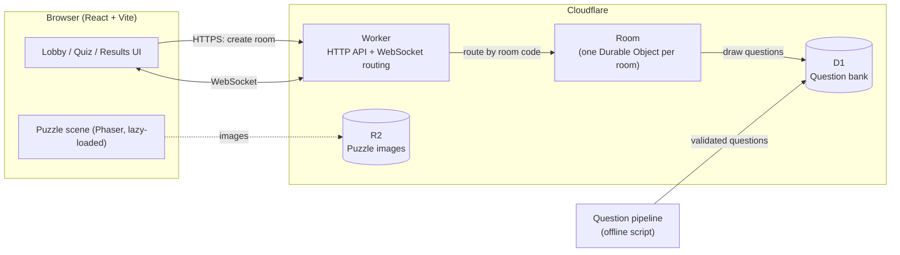
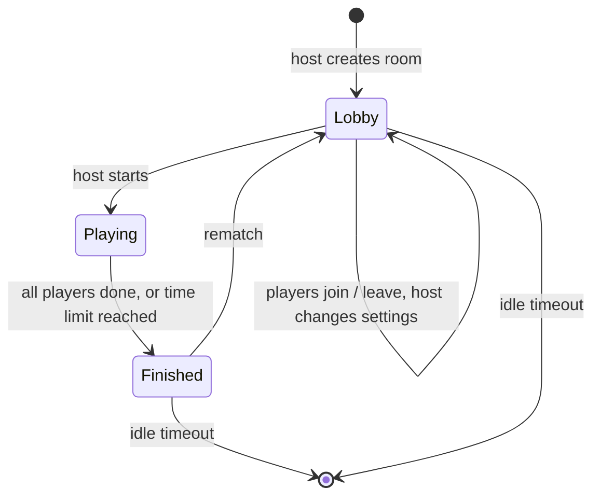

# Whizard Architecture

Whizard is a free, real-time platform for playing games with friends: a couple on a long-distance call, or a room full of people on game night. Players join a room with a nickname and a room code, everyone gets the same questions, and results appear live as each player finishes.

This document covers the system design, the key decisions behind it, and the order we build it in.

## Goals

- **Instant to play.** No accounts. Open the link, pick a nickname, enter a code, play.
- **Fair.** Everyone gets the same questions in the same order. The server owns scoring and timing, so a slow connection doesn't cost points and nobody can cheat from the browser.
- **Fast.** Moving between questions should feel instant. The first page load should be quick on a phone over 4G.
- **Cheap to run with unpredictable traffic.** Usage will come in bursts (evenings, weekends, game nights). Idle time should cost close to nothing, and a sudden spike shouldn't need manual scaling.
- **Extensible.** Quiz is the first game. Puzzles come next, then more modes, without rewriting the core.

## Non-goals (for now)

- User accounts, profiles, friends lists
- Global leaderboards
- Native mobile apps (the web app should work well on phones)
- 3D games

## High-level design



### Why a room is a Durable Object

A game room is small, short-lived and needs one source of truth. A Cloudflare Durable Object is exactly that: a single-threaded instance with its own storage, addressed by name. We name each one after its room code.

- **No routing layer.** Every player who connects with code `K7QX2M` reaches the same instance. There's no Redis pub/sub and no sticky sessions.
- **Authoritative and race-free.** One thread handles all messages for a room, so two answers arriving at the same moment can't corrupt state.
- **Close to the players.** The object is created near the first player to connect, at the edge.
- **Costs nothing while idle.** With the WebSocket hibernation API, a room waiting in the lobby isn't billed for wall-clock time. Traffic spikes just mean more rooms, and each room runs on its own.

## Repository layout

A TypeScript monorepo using pnpm workspaces:

```
whizard/
├── apps/
│   ├── web/            React + Vite client
│   └── server/         Cloudflare Worker + Room Durable Object
├── packages/
│   ├── protocol/       Message types and runtime validation (zod), shared by client and server
│   └── game-core/      Pure game logic: state machine, scoring, question selection rules
├── tools/
│   └── question-gen/   Offline pipeline that generates, checks and imports questions
└── docs/
```

`game-core` does no I/O, so it's easy to unit-test and the server and client can't drift apart on the rules.

## Game modes

### Race (first version)

The mode for two people, and the default.

1. The host creates a room and chooses a **category**, **difficulty** and **number of questions**.
2. Friends join with the room code.
3. The host starts. The room draws one question set that every player shares.
4. Each player answers at their own pace, one question after another.
5. A player who finishes goes straight to the results screen. It updates live as others finish ("Tolu is on question 7 of 20").
6. Results are final once everyone has finished, or the time limit runs out.

### Live (later)

For game nights: everyone sees each question at the same moment, the host controls the pace, and a leaderboard shows between questions. Uses the same room, protocol and scoring, with the host controlling the pace instead of each player.

### Puzzle (later)

A jigsaw race. Covered in [Puzzle mode](#puzzle-mode-later).

## Room lifecycle



- **Room codes** are 6 characters from an alphabet with no look-alike characters (no `0/O`, `1/I/L`). That gives about 900 million combinations. On creation the server checks the code is free and retries if it isn't.
- **Room state** lives in Durable Object storage, so it survives hibernation and restarts.
- **Cleanup** runs from a Durable Object alarm. A room is deleted after 30 minutes with no activity.
- **Limits:** up to 16 players per room, nicknames up to 20 characters.

## Real-time protocol

JSON messages over one WebSocket per player. Every message has a `type` and is validated with zod on both ends. Messages that fail validation are dropped and counted.

| Client → Server | Purpose |
|---|---|
| `join { nickname, sessionToken? }` | Join or rejoin a room |
| `updateSettings { category, difficulty, count }` | Host changes game settings in the lobby |
| `start {}` | Host starts the game |
| `answer { index, choice, clientElapsedMs }` | Submit an answer |
| `ping { t }` | Measure round-trip time |
| `rematch {}` | Host returns everyone to the lobby |

| Server → Client | Purpose |
|---|---|
| `welcome { playerId, sessionToken, room }` | Full snapshot on join or rejoin |
| `lobby { players, settings, hostId }` | Lobby changed |
| `question { index, total, prompt, choices, timeLimitMs }` | Next question. The correct answer is never included |
| `answerResult { index, correct, correctChoice, points, explanation? }` | Feedback after each answer |
| `progress { playerId, answered, score }` | Another player moved forward |
| `results { standings, final }` | Live or final results |
| `pong { t, serverTime }` | Reply to `ping` |
| `error { code, message }` | Something was rejected |

The protocol includes a version number so old clients get a clear "please refresh" message instead of breaking.

### Reconnection

On first join the server issues a random `sessionToken`, which the browser keeps in `sessionStorage`. If a phone locks or the network drops, the client reconnects with backoff and sends the token. The room restores that player's place: same player, same score, same question.

## Fair timing and scoring

**The server holds the answers.** A `question` message never includes the correct choice, so nothing can be found in the browser. The server checks every answer, and it sends the next question only after the current one is answered.

**Answer choices are shuffled per room** on the server, so the correct answer isn't always in the same position.

**Timing doesn't punish slow connections.** Measuring purely on the server would count each player's network delay as thinking time, which is unfair when one player is on the other side of the world. Instead:

1. The client measures how long the question was on screen before the tap (`clientElapsedMs`, using `performance.now()`).
2. The server measures the time between sending the question and receiving the answer.
3. The server accepts the client's time only if it fits inside that window, allowing for the player's measured round-trip time. Anything outside it is replaced with the server's own measurement.

This way players aren't penalised for their connection, and they can't claim an impossible time.

**Scoring** (in `game-core`, easy to tune):

```
points = correct ? round(base × (0.5 + 0.5 × (1 − elapsed / timeLimit))) : 0
base   = 1000 (easy) · 1250 (medium) · 1500 (hard)
```

A correct answer earns between 50% and 100% of the base points, depending on speed. A wrong answer or a timeout earns 0. Ties are broken by total time taken.

## Question bank

Questions are prepared ahead of time and stored, not written while players wait. That keeps games starting instantly, keeps the cost fixed however many people play, and means every question has been checked before anyone sees it.

### Schema (D1 / SQLite)

```sql
CREATE TABLE questions (
  id            TEXT PRIMARY KEY,
  category      TEXT NOT NULL,        -- bible, geography, biology, ...
  topic         TEXT,                 -- e.g. "Genesis", "Rivers", "Cell biology"
  difficulty    TEXT NOT NULL,        -- easy, medium, hard
  prompt        TEXT NOT NULL,
  choices       TEXT NOT NULL,        -- JSON array, correct answer first
  explanation   TEXT,
  reference     TEXT,                 -- e.g. "Genesis 6:14"
  content_hash  TEXT NOT NULL UNIQUE, -- normalised prompt + answer, for de-duplication
  status        TEXT NOT NULL DEFAULT 'approved',  -- approved, flagged, retired
  reports       INTEGER NOT NULL DEFAULT 0,
  rand_key      REAL NOT NULL,        -- stored random value for fast random draws
  created_at    INTEGER NOT NULL
);
CREATE INDEX idx_draw ON questions (category, difficulty, status, rand_key);
```

### Drawing a question set

- The room picks a random point and walks the `idx_draw` index from there. That's fast at any size, unlike `ORDER BY RANDOM()`.
- **Avoiding repeats:** without accounts, each browser keeps a list of recently seen question IDs. The host's list is sent when the game starts and those questions are skipped where possible.
- A **"report this question"** button increments `reports`. Questions with too many reports are flagged and hidden until reviewed.

### Generation pipeline (`tools/question-gen`)

An offline script that fills and grows the bank. It never runs during a game.

1. **Plan coverage.** Each category has a topic list (Bible: books, people, events; Geography: continents, capitals, rivers, ...). Requests are spread across topics and difficulties so the bank doesn't cluster around the same famous facts.
2. **Generate** candidate questions in batches through an LLM API, as structured JSON.
3. **Validate** each candidate against the schema: exactly one correct answer, distinct choices, length limits.
4. **De-duplicate** with a normalised content hash, plus a similarity check against existing questions on the same topic.
5. **Verify** with a separate pass that answers each question independently. If it disagrees with the stated answer, or finds the question ambiguous, the question is flagged for manual review instead of being imported. Bible questions must include a verse reference.
6. **Import** approved questions into D1.

Estimated cost is a few dollars per 10,000 questions. The pipeline can be re-run any time to add categories or refresh stale ones.

To unblock the first version, we seed it with a small hand-checked Bible set (100–200 questions) before the pipeline is built.

## Puzzle mode (later)

- Built with **Phaser**, loaded only when a puzzle game starts, so quiz players never download it.
- The server sends a **seed**. Every player's pieces are cut and shuffled from the same seed, so everyone gets an identical puzzle.
- **Images** come from a curated set, or the host uploads one. Uploads are resized in the browser, stored in R2 under the room, and deleted when the room expires.
- The score is finishing time, with move count as the tiebreak. The server records start and finish times.

## Performance targets

| Metric | Target |
|---|---|
| Next question after answering | 1 network round trip (typically under 100 ms) |
| Initial JavaScript (quiz) | under 150 KB gzipped. Phaser is loaded separately |
| Time to interactive on 4G | under 2 s |
| Room creation | under 300 ms |

## Security and abuse

- **Rate limiting** room creation and joins per IP, using the Workers rate-limiting binding.
- **Validation** of every incoming message with a size cap. Unknown or malformed messages are dropped.
- **Nickname filtering** for length, characters and a basic profanity list.
- **No personal data stored.** Nicknames and uploaded images live only as long as the room.
- **Answers never leave the server** before a player answers.

## Testing and CI

- **Unit tests** (Vitest) for `game-core`: scoring, timing clamps, the state machine, question drawing.
- **Integration tests** for the Room Durable Object, using Cloudflare's Vitest pool to run it in the real Workers runtime.
- **End-to-end tests** (Playwright): two browsers join the same room and play a full game.
- **GitHub Actions** on every pull request: lint, typecheck and tests. Merges to `main` deploy.

## Key decisions

| Decision | Chosen | Alternatives considered | Why |
|---|---|---|---|
| Real-time backend | Cloudflare Workers + Durable Objects | Node.js + `ws`/Socket.IO on a VM, with Redis for multiple servers | Rooms map directly to Durable Objects. No routing layer, no always-on server bill, handles spikes on its own |
| Frontend | React + Vite, TypeScript | Next.js | The app is interactive and client-side. A static single-page app is simpler and faster to load |
| Transport | Raw WebSocket + zod-validated JSON | Socket.IO, Colyseus | Small, explicit, typed protocol with no extra runtime dependency |
| Questions | Pre-built, verified question bank | Generating questions live per game | Instant starts, fixed cost, every question checked, easy to avoid repeats |
| 2D games | Phaser (lazy-loaded) | Plain canvas | Mature 2D engine, good fit for jigsaws |
| 3D | Not now | PlayCanvas | No 3D game is planned yet. Revisit if one is designed |
| Language | TypeScript everywhere | Java | One language across client, server and tools, with shared types. The Workers runtime runs JavaScript/TypeScript |

## Build plan

| Milestone | Scope |
|---|---|
| **M0: Foundations** | Monorepo, lint/format, CI, deployable "hello" Worker and web app |
| **M1: Rooms** | Create and join by code, nicknames, live lobby, host settings, reconnection |
| **M2: Race quiz** | Seeded Bible set, full game flow, scoring, live results, rematch |
| **M3: Question pipeline** | Generate, validate, de-duplicate, verify, import. Fill Bible, Geography and Biology |
| **M4: Polish** | Visual design, mobile layout, sounds, share link, report button, avoiding repeated questions |
| **M5: Puzzle mode** | Phaser jigsaw, shared seed, image upload |
| **M6: Live mode** | Host-paced rounds for game nights |

The first playable version is **M0 to M2**: you and a friend can play a Bible quiz race.

## Open items

- A free **Cloudflare account** is needed before the first deploy (M0).
- An **LLM API key** is needed for the question pipeline (M3).
- **Domain name:** optional. The app can run on a free `*.workers.dev` address until there is one.
